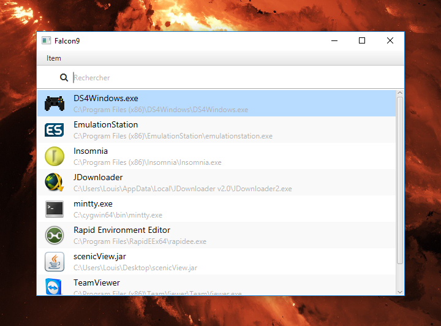

# Purpose

Falcon9 is an app launcher. It appears after you press the global keyboard shortcut and displays a list of apps. You 
can then choose one and it will get launched.

# How to install

*insert instructions*